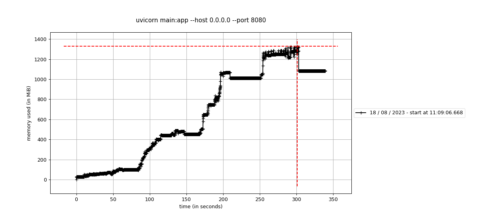
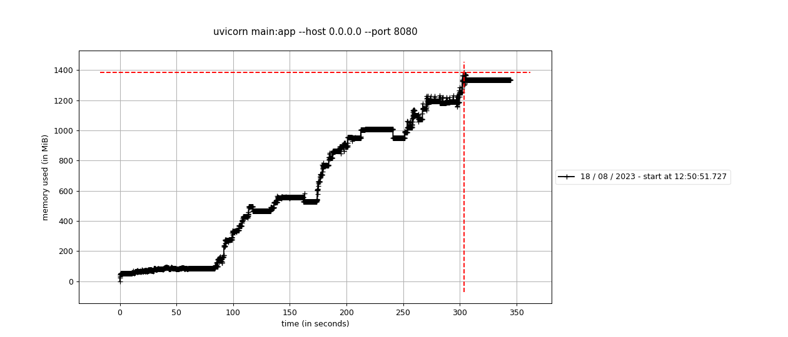
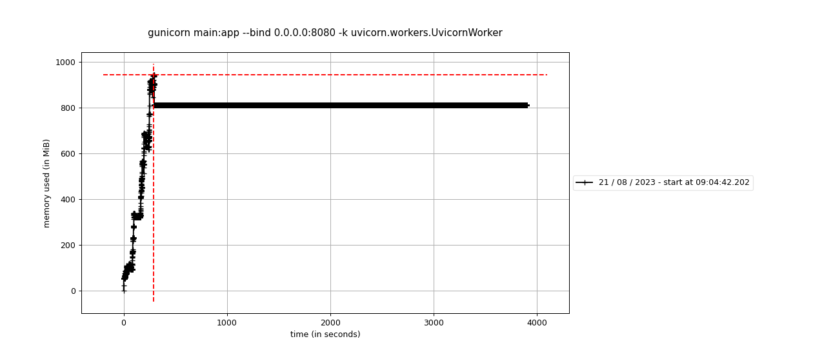

# Inference Server Benchmarks - Memory Leak Issue
This repository contains a series of benchmarks and tests designed to reproduce and analyze a memory leak issue in an inference server. Different hypothesis have been examined, with each hypothesis being tested in its dedicated environment.

## Repository Structure
Folders with tests and benchmarks:
- **test_fastapi**: Tests related to inference server based on FastAPI and Uvicorn
- **test_starlette**: Tests related to inference server based on Starlette and Uvicorn
- **test_gunicorn**: Tests related to inference server based on Starlette and Gunicorn
- **test_hypercorn**: Tests related to inference server based on Starlette and Hypercorn
- **test_sync**: Tests related to inference server based on Starlette and Uvicorn. With sync and async endpoint and set to 1 the `_default_thread_limiter` in anyio

Each test folder contains:
- **Dockerfile**: Docker environment for the specific test
- **requirements.txt**: Necessary libraries and dependencies
- **launch.sh**: Script to initiate the test
- **main.py**: Core inference server app script
- **locust_file.py**: Benchmark and load test script for locust

In the root of this repository:
- **makefile**: Automation script to manage experiments 

## Getting Started
1. Clone repository:
```
git clone <REPOSITORY_LINK_HERE>
```

2. Use make to build Docker images and reproduce results, example:
```
make build_test_fastapi
make run_test_fastapi
```

## Test Focus
The goal is to understand how our inference server behaves under different load conditions, with a special emphasis on memory consumption patterns, specifically looking for indications of memory leaks.

The general workflow looks like:
1. Setting Up the API and initialise `mprof` to capture memory usage during benchmark
2. After ensuring the API is up and running, a brief pause is introduced to capture memory usage before load testing
3. Perform load testing. For different max batch of images, namely 10, 40, 80, and 120 images per request we perform benchmark. We simulate 300 users with a spawn rate of 10 users per second and each load test runs for 30 seconds
4. After each load test iteration, a short pause is introduced to allow systems to stabilize and see if memeory consumption will decrease
5. Upon completion of all load tests, memory usage is plotted and saved  

## Observations and Results
Those results are obtained while using:
- docker 24.0.2
- Ubuntu 20.04

### Memory consumtion over time 

 <p align=center> Memory consumtion over time with starlette + unicorn


 <p align=center> Memory consumtion over time with FastApi + unicorn


 <p align=center> Memory consumtion over time with FastApi + gunicorn while waiting for 1 hour after the test ends. 


### Difference in memory consumtion between starting time and the test end

Test |Memory after starting the API (MB) | Memory usuage after the test (MB)
--- | --- | --- |
Fastapi + Uvicorn | 54.30 | 1333.76|
Starlette + Uvicorn | 27.96 | 1081.51|
Starlette + Gunicorn | 53.92 | 809.54|
Starlette + Hypercorn | 61.88 | 1416.56|
Starlette + Uvicorn + sync endpoint + thread_limiter | 28.28 | 1127.46 | 
Starlette + Uvicorn + async endpoint + thread_limiter | 27.59 | 1049.04 | 
